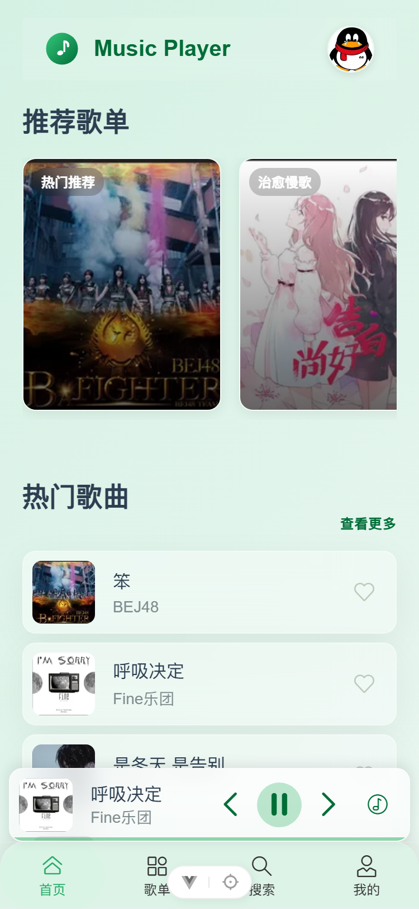
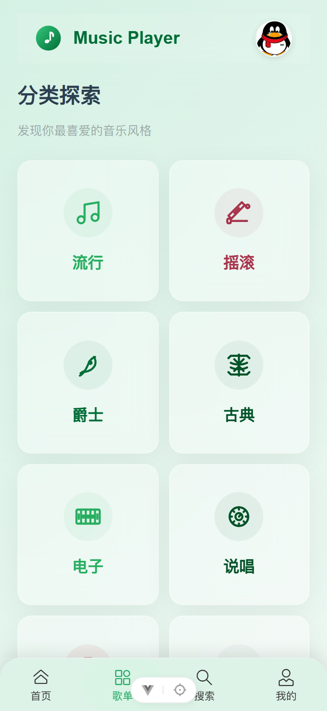
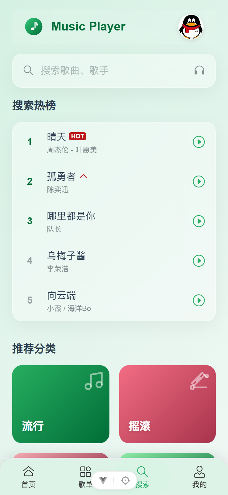
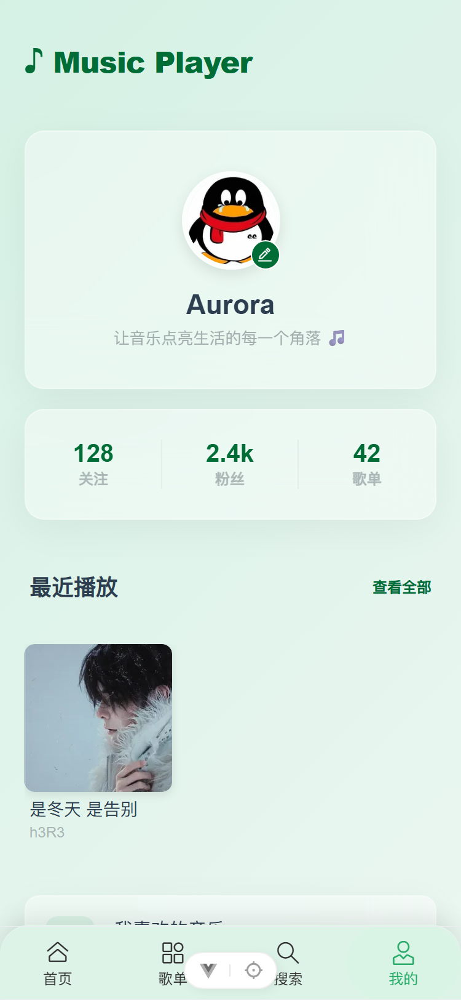
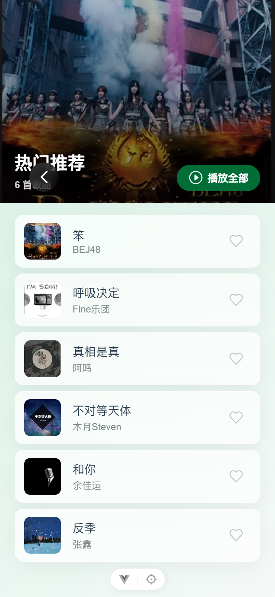
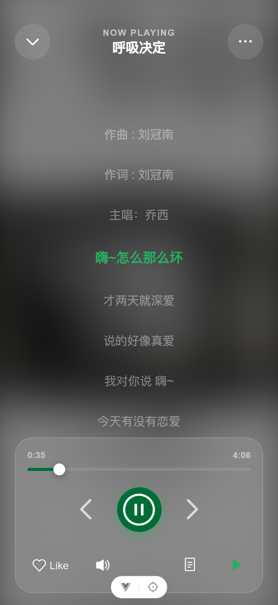

# 🎵 移动端音乐播放器

前后端分离的**移动端 H5 音乐播放器**。支持全局音频播放、歌词同步高亮、歌单分类浏览、搜索、收藏、播放历史与用户账号体系，覆盖从「发现音乐」到「正在播放」的完整链路。

前端源码与工程化细节见 [frontend/README.md](frontend/README.md)。

---

## 界面预览

| 首页 | 歌单分类 | 搜索 | 我的 |
| :---: | :---: | :---: | :---: |
|  |  |  |  |

| 歌单详情 | 播放页 · 唱片 | 播放页 · 全屏歌词 |
| :---: | :---: | :---: |
|  |  |  |

> 截图基于本地演示数据；点击图片可查看原图。更多截图见 [images/](images/)。

---

## 目录

- [核心功能](#核心功能)
- [技术栈](#技术栈)
- [页面与路由](#页面与路由)
- [系统架构](#系统架构)
- [快速开始](#快速开始)
- [API 概述](#api-概述)
- [项目结构](#项目结构)
- [开发规范](#开发规范)

---

## 核心功能

| 模块 | 说明 |
| ---- | ---- |
| 全局播放 | 首页迷你播放条 + 全屏播放页：播放/暂停、上下曲、进度拖动、音量调节、三种播放模式（列表循环/单曲循环/随机） |
| 歌词同步 | LRC 逐行高亮 + 平滑滚动（rAF + easeOutCubic），唱片页小歌词 / 全屏歌词双模式 |
| 歌单系统 | 分类浏览、歌单详情、分类详情，单曲或整单播放 |
| 搜索 | 300ms 防抖搜索、搜索热榜、分类卡片，搜索历史按用户隔离 |
| 收藏 / 历史 | 歌曲收藏与最近播放，按用户隔离，可一键续播 |
| 用户中心 | 注册/登录（JWT）、修改密码、头像上传（前端压缩）、注销账号 |
| 稳健播放 | 快速切歌竞态防护、缓冲指示、加载失败重试、自动播放限制适配（手势后恢复） |

> 性能与健壮性等工程实现（首屏骨架屏、封面三档 WebP、内存缓存、5 层错误捕获体系等）见 [frontend/README.md](frontend/README.md)。

---

## 技术栈

| 层 | 组成 |
| --- | --- |
| 前端 | Vue 3 · Vue Router · Pinia 4 · Vant 4 · SCSS · Axios · Vite（375 设计稿 vw 适配） |
| 工程化 | pnpm · oxlint + ESLint + Prettier · husky + lint-staged · GitHub Actions（lint + build） |
| 后端 | Express 5 · JWT · bcryptjs · multer · sharp（封面三档 WebP）· JSON 文件存储（无数据库） |

---

## 页面与路由

| 路由 | 页面 | 说明 | Tabbar | 需登录 |
| ---- | ---- | ---- | :----: | :----: |
| `/home` | 首页 | 推荐歌单、热门歌曲，正在播放时底部有迷你条 | ✅ | — |
| `/category` | 歌单分类 | 8 类风格色卡 + 为您推荐歌单 | ✅ | — |
| `/search` | 搜索 | 搜索热榜、分类卡片、搜索结果 | ✅ | — |
| `/mine` | 我的 | 用户信息、收藏、最近播放、设置/注销 | ✅ | ✅ |
| `/playlist/:id` | 歌单详情 | 歌单内歌曲列表（支持整单播放） | — | — |
| `/category/:id` | 分类详情 | 按风格浏览歌曲（与歌单详情共用详情页） | — | — |
| `/play` | 播放页 | 全屏播放器：唱片封面 ↔ 全屏歌词模式切换 | — | — |
| `/login` `/register` | 登录 / 注册 | 账号登录、注册 | — | — |
| `/changePwd` | 修改密码 | 修改登录密码 | — | ✅ |

> 前 4 个为 Tabbar 一级页；二级页不显示 Tabbar。`requiresAuth` 页面由路由守卫拦截，未登录统一跳转 `/login`。根路径 `/` 重定向 `/home`。

---

## 系统架构

前后端分离：**Vue 3 前端（H5）**通过 HTTP 调用 **Express 后端**，后端基于 JSON 文件存储，无需数据库。

```
浏览器 (H5)
  │  前端：views（视图）→ Pinia（状态）→ useAudio（音频引擎）→ axios（拦截/重试/取消/缓存）
  ▼  HTTP（Vite 代理 /api、/audio、/covers、/avatars）
Express 后端：路由层 → 鉴权中间件（JWT）→ 静态资源 → store.js（JSON 原子读写）
```

**数据流**：前端 `api/`（axios）→ Express 路由 → JSON 存储 → 返回数据 → Pinia 更新状态 → 视图渲染。音频、封面、头像由后端托管静态资源，前端经 Vite 代理直接访问。

---

## 快速开始

### 环境要求

- **Node.js** ≥ 22.18（推荐 22 LTS 或 24）
- **pnpm** ≥ 9

### 安装与启动

```bash
# 1. 克隆仓库
git clone https://github.com/evs-vis/music-player.git
cd music-player

# 2. 启动后端
cd backend
pnpm install
node server.js          # 默认 http://localhost:3000

# 3. 启动前端（另开终端）
cd ../frontend
pnpm install
pnpm dev                # 默认 http://localhost:5173
```

打开浏览器访问 `http://localhost:5173` 即可使用。

> 音频/封面等演示数据不随仓库分发，需按部署约定自行准备到 `backend/public/`（见 [docs/开发规范.md](docs/开发规范.md) 本地文档）。

### 环境变量

| 变量 | 位置 | 说明 |
| ---- | ---- | ---- |
| `VITE_API_BASE_URL` | frontend | 前端指向后端地址（默认走 Vite 代理，无需设置） |
| `JWT_SECRET` | backend | JWT 签名密钥（生产必填，缺省用内置开发密钥） |

### 常用脚本

| 位置 | 命令 | 说明 |
| ---- | ---- | ---- |
| frontend | `pnpm dev` / `pnpm build` / `pnpm preview` | 开发 / 构建 / 预览构建产物 |
| frontend | `pnpm lint` / `pnpm format` | 代码检查（oxlint + eslint）/ Prettier 格式化 |
| backend | `node scripts/optimize-covers.mjs` | 封面三档 WebP 生成（480/240/112） |

---

## API 概述

基础路径：`/api`（开发环境经 Vite 代理到 `http://localhost:3000`）。

### 歌曲 & 歌单

| 方法 | 路径 | 说明 |
| ---- | ---- | ---- |
| `GET` | `/api/songs` | 获取歌曲列表（剥离歌词，按需拉取） |
| `GET` | `/api/songs/:id` | 获取歌曲详情（含歌词） |
| `GET` | `/api/playlists` | 获取歌单列表 |

### 认证（公开）

| 方法 | 路径 | 说明 |
| ---- | ---- | ---- |
| `POST` | `/api/register` | 注册账号（不自动登录） |
| `POST` | `/api/login` | 登录（返回 JWT） |

### 用户数据（需 `Authorization: Bearer <token>`）

| 方法 | 路径 | 说明 |
| ---- | ---- | ---- |
| `GET` / `POST` | `/api/user/favorites` | 获取 / 添加收藏 |
| `GET` / `POST` | `/api/user/history` | 获取 / 添加播放历史 |
| `DELETE` | `/api/user/history` | 清空播放历史 |
| `GET` / `POST` | `/api/user/search-history` | 获取 / 添加搜索历史 |
| `DELETE` | `/api/user/search-history` | 清空搜索历史 |
| `PUT` | `/api/user/password` | 修改密码 |
| `POST` | `/api/user/avatar` | 上传头像（multipart，前端压缩后恒小于后端 2MB 限制） |
| `DELETE` | `/api/user` | 注销账号 |

### 静态资源

| 路径 | 说明 |
| ---- | ---- |
| `/audio/*` | 音频文件（MP3） |
| `/covers/*` | 歌曲封面图（含 `-112.webp` / `-240.webp` 缩略图） |
| `/avatars/*` | 用户头像 |

> 登录返回 `{ token, user }`；注册返回 `{ message }`；错误响应统一 `{ error: "描述" }`。

---

## 项目结构

```
music-player/
├── README.md                  # 仓库总览（本文件）
├── images/                    # README 界面截图
├── .github/workflows/ci.yml   # CI：自动 lint + build
├── frontend/                  # Vue 3 前端（详见 frontend/README.md）
│   └── src/
│       ├── api/  components/  composables/  router/  stores/
│       ├── styles/  utils/  views/
│       └── App.vue · main.js · index.html
└── backend/                   # Express 后端（JSON 存储）
    ├── server.js  store.js  jsonfs.js  config.js  accessLog.js
    ├── middleware/user.js     # JWT 鉴权
    ├── scripts/               # 封面三档 WebP 生成
    ├── data/                  # 数据文件（不入库）
    └── public/                # 音频/封面/头像静态资源（不入库）
```

---

## 开发规范

> 完整约定见 [docs/开发规范.md](docs/开发规范.md)（全面）与 [docs/前端开发规范.md](docs/前端开发规范.md)（前端专项）——**均为仓库内本地文档，不入库**。

- **代码检查**：oxlint + ESLint（`pnpm lint`），提交前 husky + lint-staged 自动 `eslint --fix` + `prettier --write`
- **分支**：默认 `master`，功能开发建议开 `feature/*` 分支
- **CI**：push / PR 自动运行 lint + build（`.github/workflows/ci.yml`）
- **数据隔离**：后端 JSON 数据（`backend/data/`）与用户上传头像不入库，含用户密码哈希等隐私数据
